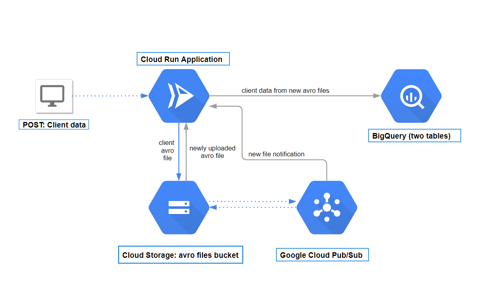

# Test appliation for RinfTech Internship

API:
POST on /api/avro/generate: {long "id" Required, string "name" Required, string "phone", string "address", boolean "verified", float "bill"} to add client, generate avro file and upload it into bucket.
